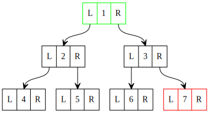

## Assignment 4
### GraphViz - Binary Tree
#### Binary Tree created using dot language in graphviz online code editor there are 7 total nodes in the tree. The left and right pointers
#### of each node are pointing to their appropriate child node.

